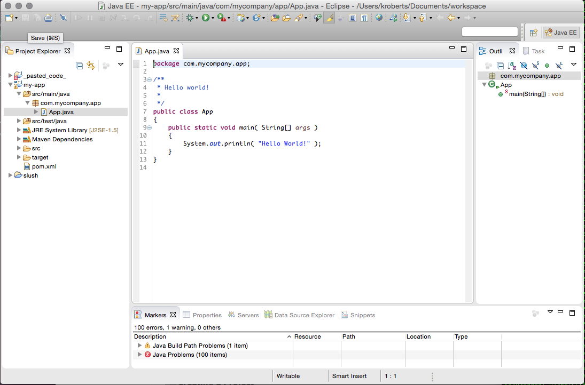
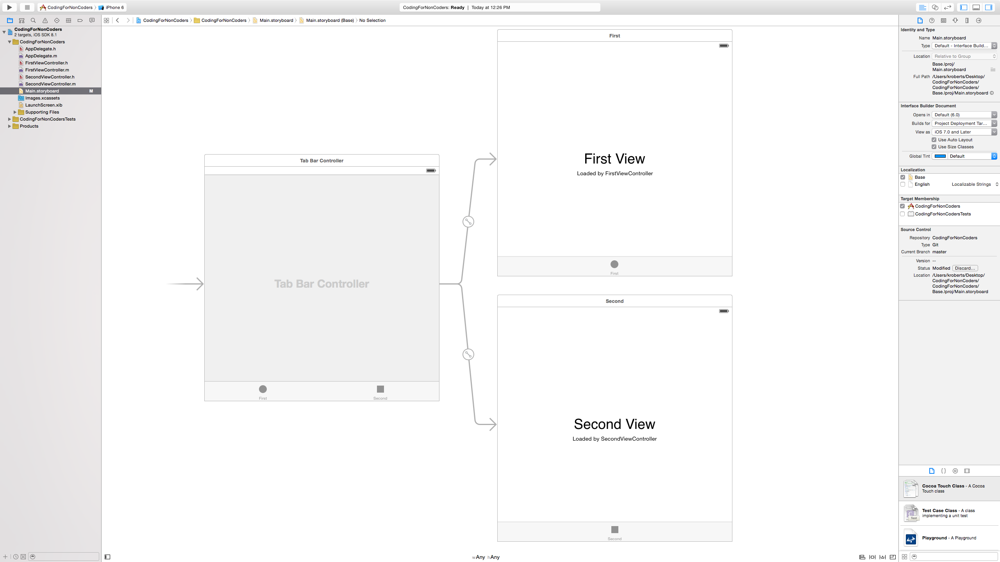
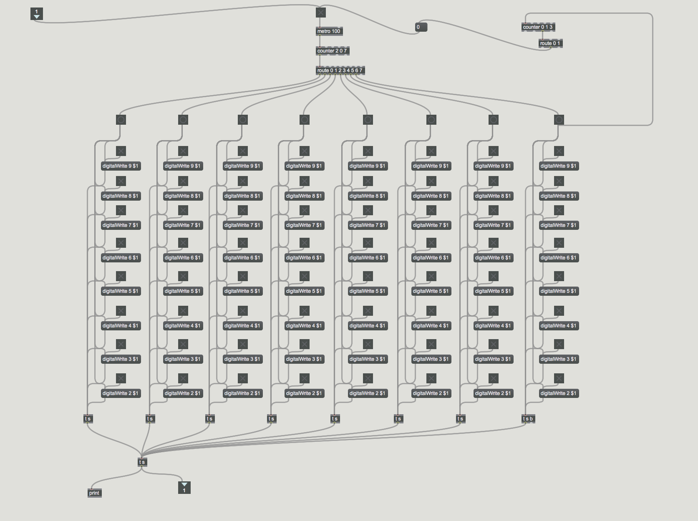

##Coding for Non-Coders

---

##It's Not Magic.

#It's Magical.

---

##HTML - A Brief History
- Tag Soup
- Browser Wars
- W3C
- XHTML
- HTML5

---
##Vocabulary
###Symbols
- ! - bang
- & - ampersand
- [] - brackets
- {} - braces
- () - parens
- / - slash
- \ - backslash
- | - pipe
- ^ - caret
- $ - dollar
- \# - hash

---
##Vocabulary
###Language Constructs
- comments
- hash
	- property
	- value

---

#Parts of a Web Page

---

##HTML = Structure

- tag
	- closing
	- self closing
- attribute

---
##HTML = Structure

###Exercise: Hello, World!

---

##CSS = Style

- selector
- rule

---

##CSS = Style

###Exercise: Bigger Hello, World!

---

##Javascript = Behavior

- variable
- function
- object
- array
- string
- number
- date

---

##Javascript = Behavior

###Exercise: Alert Hello, World!

---

##&lt;tags&gt;
- p
- h1 - h6
- a
- div
- span
- img
- ul/li
- ol/li
- header, article, aside, footer

---

##&lt;tags&gt;
###Exercise: Build your page

---

##styles {}
- color
- background
- width
- height
- padding
- margin
- border

---
##styles {}
###Exercise: Style your page

---

##scripting () {...}
- console
- console.log()

---

##&lt;forms&gt;
- form
- input
- button
- label

---

##id= and class=
- ids are unique
- classes group elements
- Document Object Model
- document.getElementById()

---

##(function ($) {...})(jQuery)
###Exercise: Temperature Conversion

---

##(function ($) {...})(jQuery)
###Exercise: Temperature Conversion

---

#Welcome, Coder

---

##Web Servers
- files and directories
- http and paths

---

##Web Servers
###Exercise: Upload you site to S3

---

##Other Kinds of Programming

---

##Java

---

##iOS

---

##Max/MSP

---

##Learn More
- [General Assembly](https://generalassemb.ly/washington-dc)
- [Codecademy](http://www.codecademy.com/)

